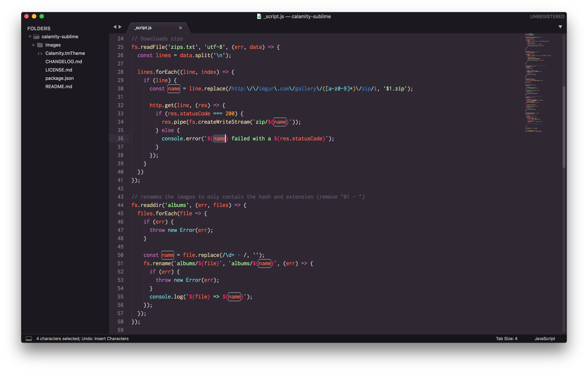

# [Calamity Theme for Sublime Text](https://github.com/surajmandalcell/calamity2-sublime)
> A purple dark theme with medium  to low contrast for [Sublime Text](https://www.sublimetext.com/)

## Supported languages

- JavaScript
- CSS
  - SCSS
- PHP
- SQL
- Pug / Jade
- HTML / XML
- Markdown
- JSON
- YAML

## Contributing

If you want more languages a PR is always welcome! 🙂

### To-do

- Add logo
- Add screenshot
- Add ayu to this theme
- add sass, c++, python support

## Original creator

[Pustur](https://github.com/Pustur)

## License
see license.md
[Original creator](https://github.com/Pustur/calamity-sublime/blob/master/LICENSE.md)
